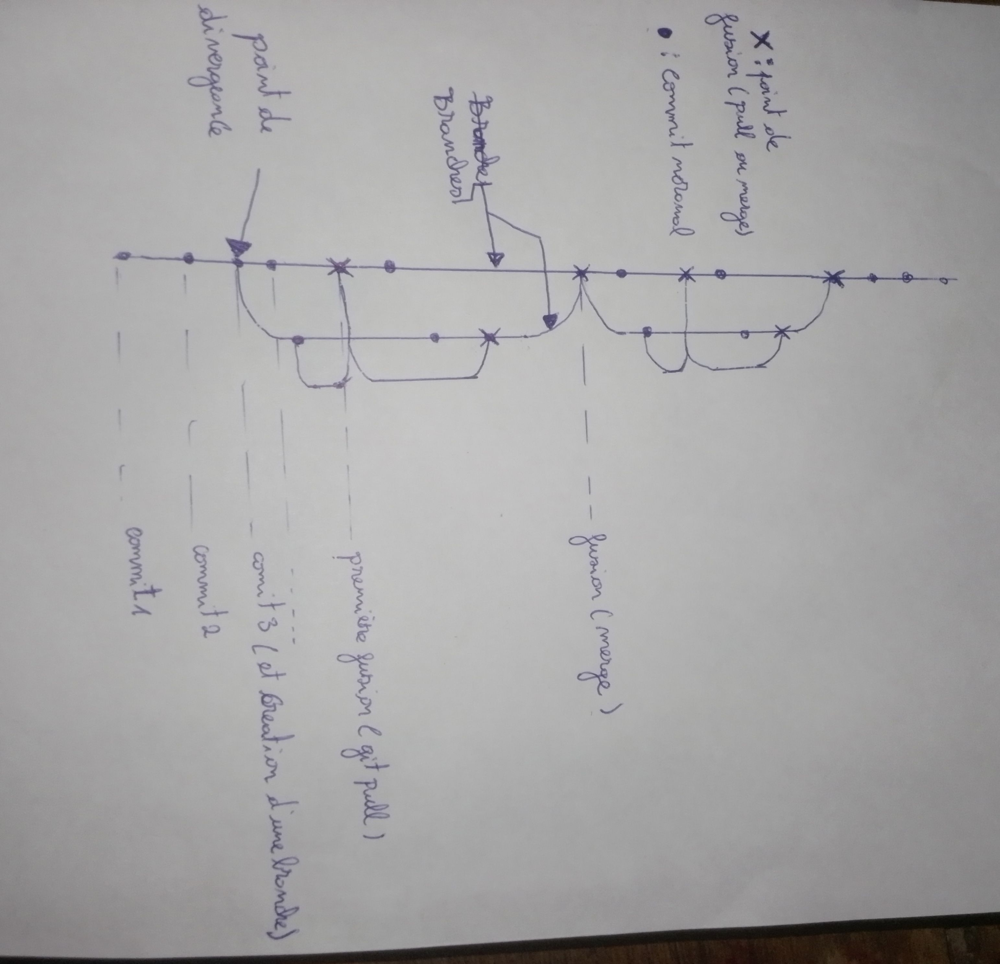

# Démonstration 1 : Représentation Graphique des Commits et Correspondance `git log --graph`

## 1. Explication des Symboles du Graphe sur papier

sur la capture ci dessous,on peut visualiser l'historique des commits sous forme d'un réseau de nœuds et de branches :



* **Les nœuds simples (boules pleines) :** Représentent des **commits ordinaires** contenant des modifications individuelles de code.
* **Les nœuds doubles (croix) :** Représentent des **commits de fusion (*Merge ou pull*)**, générés automatiquement ou manuellement lors du raccordement de deux branches.
* **Les lignes verticales :** Représentent les branches (ex: la branche locale `master` et sa version distante `origin/master`).

---

## 2. Éléments Clés Repérés sur le Dépôt Réel

1. **Point de divergence :** Lieu où une seconde ligne parallèle apparaît, indiquant que des commits ont été effectués séparément sur la copie locale et sur le dépôt distant.
2. **Point de fusion (Merge) :** Représenté par les croix (ex: `Merge branch 'master' of https://github.com/dikoume-stephane/ani-test`), marquant la réintégration des modifications distantes dans la branche locale.

---

## 3. Correspondance avec `git log --graph --oneline`

L'exécution de la commande sous forme textuelle reproduit fidèlement la même structure :

```powershell
git log --graph --oneline
* c4e7b15 (HEAD -> master, origin/master, origin/HEAD) suppression du gros fichier binaire
* b272367 ajout d'un gros fichier binaire de 10Mo
* 221485d (feature-test) feat: ajout sur la branche feature-test
* 0e4422a feat: ajout des modifications sur la branche master
* 397e28c fix: ajout d'une section economie
* 2a2d6df Revert "fix: duppression de la section de presentation du projet dans le fichier fichier2.md"
* 08a92ab fix: duppression de la section de presentation du projet dans le fichier fichier2.md
*   639a99f Merge branch 'master' of https://github.com/dikoume-stephane/ani-test
|\  
| *   a0c537d Merge branch 'master' of https://github.com/dikoume-stephane/ani-test
| |\  
| * | 56e33bb fix(correction): correction du fichier fichier2.md sur la section reseau
* | | 94d5e5f fix(correction): correction du fichier fichier2.md sur la section conventios git
| |/  
|/|   
* | 774b58e fix: resolution du conflit de fusion sur mesure.md
|\| 
| * 5ea52c5 fix: modification de l'etete du fichier mesure.md
* | fef3ff4 fix: modification du mesure.md
|/  
*   6696fc1 Merge branch 'master' of https://github.com/dikoume-stephane/ani-test
|\  
| *   1f809e8 Merge branch 'master' of https://github.com/dikoume-stephane/ani-test
| |\  
| * | 385918a fix: modification
* | | a4dafc0 fix: modification du mesure.md
| |/  
|/|   
* | 4bc4593 fix: resolution du conflit de fusion
|\| 
| * e428aca fix: modification de mesure.md
* | 449e131 fix: modification de mesure.md
|/  
* 255efd1 feat: ajout de la ligne 3
* 38f6070 feat: ajout de la ligne 2
* ca79033 feat: ajout initial du fichier de mesure
* de83a5b meodification des formats de commit dans le fichier md
* 6592978 meodification du nom du projet dans le fichier md
* 0cbc7e1 meodification du fichier md
* f791111 meodification du fichier md
* a7ca645 docs: structure de base du fichier Markdown
* d31e203 modification du fichier tex
* 8cc8802 contenu initial de fichier1
* a036b3b retour à zero
* 8c86bdd mise a jour de fichier1.txt
* b338f00 feat: ajout du fichier 3
* 317cd70 feat: ajout du fichier 2
* d16ea0f feat: ajout du fichier 1
(END)
```
