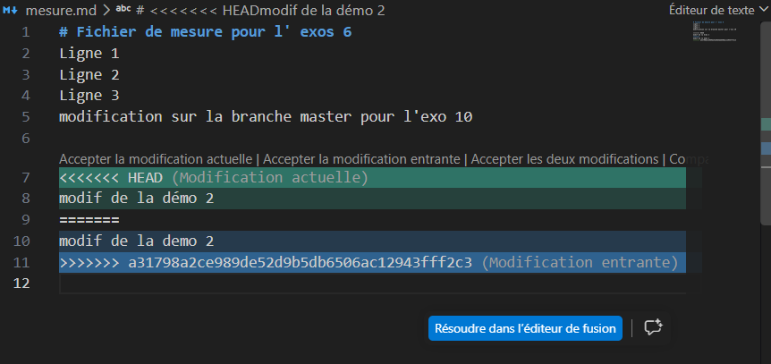

# Démonstration 2 : Déclenchement et Résolution d'un Conflit Git en Direct

### d'exécution du conflit 

1. **Créer le conflit :**
* j'Ouvrez un terminal sur mon dépôt d'essai `ani-test`.
* je fait une modification dans le clone 1 sur `mesure.md` puis, je pousse sur GitHub.

```powershell
 git diff
diff --git a/mesure.md b/mesure.md
index ff3ebaf..5070d7c 100644
--- a/mesure.md
+++ b/mesure.md
@@ -2,4 +2,6 @@
 Ligne 1
 Ligne 2
 Ligne 3
-modification sur la branche master pour l'exo 10
\ No newline at end of file
+modification sur la branche master pour l'exo 10
+
+modif de la demo 2
\ No newline at end of file
PS D:\2DS\projet\programmation_cpp\niveau 2\sprint_1\ani-test> git add .
PS D:\2DS\projet\programmation_cpp\niveau 2\sprint_1\ani-test> git commit -m "modification pour la demo 2"
[master a31798a] modification pour la demo 2
 1 file changed, 3 insertions(+), 1 deletion(-)
PS D:\2DS\projet\programmation_cpp\niveau 2\sprint_1\ani-test> git push
Enumerating objects: 5, done.
Counting objects: 100% (5/5), done.
Delta compression using up to 4 threads
Compressing objects: 100% (3/3), done.
Writing objects: 100% (3/3), 306 bytes | 102.00 KiB/s, done.
Total 3 (delta 2), reused 0 (delta 0), pack-reused 0 (from 0)
remote: Resolving deltas: 100% (2/2), completed with 2 local objects.
To https://github.com/dikoume-stephane/ani-test.git
   c4e7b15..a31798a  master -> master
PS D:\2DS\projet\programmation_cpp\niveau 2\sprint_1\ani-test> 
```

* Dans le clone 2 local, je modifie la **même ligne** de `mesure.md` avec un texte différent, je faites un `git commit`, puis lance un `git pull`

* **Moment clé :** Le terminal affiche `CONFLICT (content): Merge conflict in mesure.md`.
```powershell
git diff

diff --git a/mesure.md b/mesure.md
index ff3ebaf..23116d6 100644
--- a/mesure.md
+++ b/mesure.md
@@ -2,4 +2,6 @@
 Ligne 1
 Ligne 2
 Ligne 3
-modification sur la branche master pour l'exo 10
\ No newline at end of file
+modification sur la branche master pour l'exo 10
+
+modif de la démo 2
\ No newline at end of file
PS D:\2DS\projet\programmation_cpp\niveau 2\sprint_1\exo-git> git add .
PS D:\2DS\projet\programmation_cpp\niveau 2\sprint_1\exo-git> git commit -m "modification pour la demo 2 dans le clone"
[master 0191015] modification pour la demo 2 dans le clone
 1 file changed, 3 insertions(+), 1 deletion(-)
PS D:\2DS\projet\programmation_cpp\niveau 2\sprint_1\exo-git> git pull
>> 
remote: Enumerating objects: 5, done.
remote: Counting objects: 100% (5/5), done.
remote: Compressing objects: 100% (1/1), done.
remote: Total 3 (delta 2), reused 3 (delta 2), pack-reused 0 (from 0)
Unpacking objects: 100% (3/3), 286 bytes | 10.00 KiB/s, done.
From https://github.com/dikoume-stephane/ani-test
   c4e7b15..a31798a  master     -> origin/master
Auto-merging mesure.md
CONFLICT (content): Merge conflict in mesure.md
Automatic merge failed; fix conflicts and then commit the result.
```


2. **Lecture des marqueurs :**
* en ouvrant `mesure.md` dans VS Code, on vois les marqueurs générés par Git :
```text
<<<<<<< HEAD
Texte modifié localement dans le clone 2
=======
Texte qui vient d'être rapatrié depuis GitHub (clone 1)
>>>>>>> 5ea52c5...

```



3. **Prise de décision et Résolution :**
* Explication :Ici, on garde la version la plus complète ou qui nous arrange.
* cliquer sur l'une des option au dessus des marqueur pour choisir.


4. **Reconstruction et Validation :**
* Marquez le conflit comme résolu en faisant : `git add mesure.md`, `git commit -m "fix: resolution du conflit de fusion"` et `git push`
