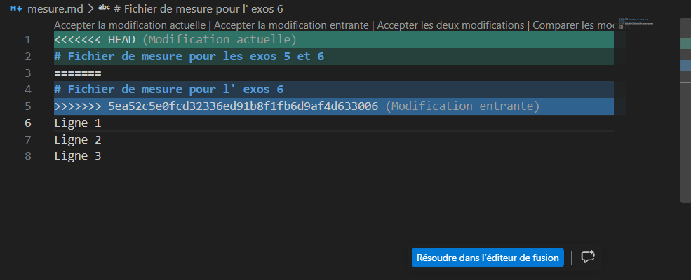

# Exercice 6 : Simulation, gestion et résolution d'un conflit de fusion 

---

## Étape 1 : clone du depot d'exercice avant toute modification

le depost à ete cloner dans un autre dossier sur le pc avec la commande `git clone https://github.com/dikoume-stephane/ani-test.git`

## Étape 2 : Modification et publication depuis le premier clone (Clone 1)

Dans ce premier répertoire de travail, nous modifions la premiere ligne du fichier cible (mesure.md), nous enregistrons cette modification dans un commit local, puis nous la poussons .

* **Commandes exécutées :**les commande executées sont `git add mesure.md`, `git commit -m "fix: modification de l'etete du fichier mesure.md"` et `git push`
* **resultats :**
```powershell
 D:\2DS\projet\programmation_cpp\niveau 2\sprint_1\ani-test> git add mesure.md
PS D:\2DS\projet\programmation_cpp\niveau 2\sprint_1\ani-test> git commit -m "fix: modification de l'etete du fichier mesure.md"
[master 5ea52c5] fix: modification de l'etete du fichier mesure.md
 1 file changed, 1 insertion(+), 1 deletion(-)
PS D:\2DS\projet\programmation_cpp\niveau 2\sprint_1\ani-test> git push
Enumerating objects: 5, done.     
Counting objects: 100% (5/5), done.
Delta compression using up to 4 threads
Compressing objects: 100% (3/3), done.
Writing objects: 100% (3/3), 331 bytes | 36.00 KiB/s, done.
Total 3 (delta 1), reused 0 (delta 0), pack-reused 0 (from 0)
remote: Resolving deltas: 100% (1/1), completed with 1 local object.
To https://github.com/dikoume-stephane/ani-test.git
   6696fc1..5ea52c5  master -> master
PS D:\2DS\projet\programmation_cpp\niveau 2\sprint_1\ani-test> 
```
## Étape 3 : Modification concurrente depuis le deuxième clone (exo-git), Refus du Push & Conflit
Sans effectuer un `git pull` préalable pour récupérer les modifications publiée par le premier clone, nous fesons une modification sur la même ligne de mesure.md dans la seconde copie locale.

Lors de la première tentative d'envoi vers le serveur distant, la commande git push est rejetée car le dépôt distant contient un travail non présent localement.
```powersell
D:\2DS\projet\programmation_cpp\niveau 2\sprint_1\exo-git> git pull
Already up to date.
PS D:\2DS\projet\programmation_cpp\niveau 2\sprint_1\exo-git> git add mesure.md                         
PS D:\2DS\projet\programmation_cpp\niveau 2\sprint_1\exo-git> git commit -m "fix: modification du mesure.md"
[master fef3ff4] fix: modification du mesure.md
 1 file changed, 1 insertion(+), 1 deletion(-)
PS D:\2DS\projet\programmation_cpp\niveau 2\sprint_1\exo-git> git push
fatal: unable to access 'https://github.com/dikoume-stephane/ani-test.git/': Could not resolve host: github.com
PS D:\2DS\projet\programmation_cpp\niveau 2\sprint_1\exo-git> git push
fatal: unable to access 'https://github.com/dikoume-stephane/ani-test.git/': Could not resolve host: github.com
PS D:\2DS\projet\programmation_cpp\niveau 2\sprint_1\exo-git> git push
fatal: unable to access 'https://github.com/dikoume-stephane/ani-test.git/': Could not resolve host: github.com
PS D:\2DS\projet\programmation_cpp\niveau 2\sprint_1\exo-git> git push

To https://github.com/dikoume-stephane/ani-test.git
 ! [rejected]        master -> master (fetch first)
error: failed to push some refs to 'https://github.com/dikoume-stephane/ani-test.git'
hint: Updates were rejected because the remote contains work that you do not
hint: have locally. This is usually caused by another repository pushing to
hint: the same ref. If you want to integrate the remote changes, use
hint: 'git pull' before pushing again.
hint: See the 'Note about fast-forwards' in 'git push --help' for details.
```
## etape 4 : Intégration des modifications distantes, Résolution du Conflit et Push Final
comme l'avertissement de Git le mentionne, l'exécution de `git pull` rapatrie l'historique distant. Comme la même ligne a été éditée différemment dans les deux révisions, la fusion automatique échoue et déclenche un conflit de contenu (CONFLICT (content)).



Une fois le fichier mesure.md édité pour sélectionner la bonne version du texte et supprimer les balises de conflit (<<<<<<<, =======, >>>>>>>), le fichier est marqué comme résolu via `git add`, validé par un commit de fusion, puis poussé avec succès vers le serveur.
```powersell
D:\2DS\projet\programmation_cpp\niveau 2\sprint_1\exo-git> git pull

remote: Enumerating objects: 5, done.
remote: Counting objects: 100% (5/5), done.
remote: Compressing objects: 100% (2/2), done.
remote: Total 3 (delta 1), reused 3 (delta 1), pack-reused 0 (from 0)
Unpacking objects: 100% (3/3), 311 bytes | 9.00 KiB/s, done.
From https://github.com/dikoume-stephane/ani-test
   6696fc1..5ea52c5  master     -> origin/master
Auto-merging mesure.md
CONFLICT (content): Merge conflict in mesure.md
Automatic merge failed; fix conflicts and then commit the result.
PS D:\2DS\projet\programmation_cpp\niveau 2\sprint_1\exo-git> git add mesure.md
PS D:\2DS\projet\programmation_cpp\niveau 2\sprint_1\exo-git> git commit -m "fix: resolution du conflit de fusion sur mesure.md"
[master 774b58e] fix: resolution du conflit de fusion sur mesure.md
PS D:\2DS\projet\programmation_cpp\niveau 2\sprint_1\exo-git> git push
Enumerating objects: 8, done.
Counting objects: 100% (8/8), done.
Delta compression using up to 4 threads
Compressing objects: 100% (4/4), done.
Writing objects: 100% (4/4), 531 bytes | 44.00 KiB/s, done.
Total 4 (delta 1), reused 0 (delta 0), pack-reused 0 (from 0)
remote: Resolving deltas: 100% (1/1), completed with 1 local object.
To https://github.com/dikoume-stephane/ani-test.git
   5ea52c5..774b58e  master -> master
```
## Analyse Technique de l'Exercice
1. Pourquoi le git push du second clone a-t-il été rejeté ?
* Raison principale : Le dépôt distant possédait une révision plus récente que la base locale du second clone.

* Mécanisme de sécurité : Git interdit par défaut d'écraser l'historique distant si la branche locale n'est pas une suite directe de la branche distante (non-fast-forward update). Il oblige l'utilisateur à intégrer la version distante dans son environnement local avant de pouvoir publier.

2. Qu'est-ce qui a provoqué le conflit lors du git pull ?
Cause du conflit : Les deux commits ( sur le clone 1 et sur le clone 2) modifiaient la même ligne du même fichier (mesure.md) à partir du même commit parent .
