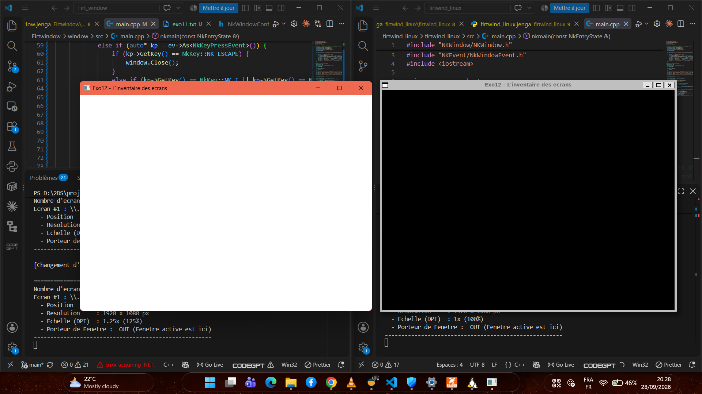

# Chapitre 03 — Démo 4 : Exécution du même code sur deux systèmes différents

## 1. code compilé
```cpp
#include "NKWindow/NKWindow.h"
#include "NKWindow/NKMain.h"
#include "NKEvent/NkWindowEvent.h"
#include <iostream>

using namespace nkentseu;

// Parcourt les écrans connectés et identifie celui contenant la fenêtre
void ListMonitors(const NkWindow& window) {
    auto monitors = window.EnumerateMonitors();
    auto currentM = window.GetCurrentMonitor();
    math::NkVector2i winPos = window.GetPosition();
    math::NkVector2i winSize = window.GetSize();
    bool containsWindow;
    
    std::cout << "\n================ INVENTAIRE DES ECRANS ================" << std::endl;
    std::cout << "Nombre d'ecrans detectes : " << window.GetMonitorCount() << std::endl;

    for (usize i = 0; i < monitors.Size(); ++i) {
        const auto& mon = monitors[i];
        float scale = mon.dpiScale;      // Facteur d'échelle (DPI Scale)
        if ( mon.index == window.GetCurrentMonitor().index) containsWindow =true ;
        std::cout << "Ecran #" << (i + 1) << " : " << mon.name << std::endl;
        std::cout << "  - Position       : (" << mon.posX << ", " << mon.posY << ")" << std::endl;
        std::cout << "  - Resolution     : " << mon.width << " x " << mon.height << " px" << std::endl;
        std::cout << "  - Echelle (DPI)  : " << scale << "x (" << static_cast<int>(scale * 100) << "%)" << std::endl;
        std::cout << "  - Porteur de Fenetre : " << (containsWindow ? " OUI (Fenetre active est ici) " : "Non") << std::endl;
        std::cout << "------------------------------------------------------" << std::endl;
    }
}

int nkmain(const NkEntryState& state) {
    NkWindowConfig cfg;
    cfg.title  = "Exo12 - L'inventaire des ecrans";
    cfg.width  = 800;
    cfg.height = 600;

    NkWindow window(cfg);
    if (!window.IsOpen()) {
        return -1;
    }

    std::cout << "=================== INSTRUCTIONS ===================" << std::endl;
    std::cout << " Deplacez la fenetre d'un ecran a un autre." << std::endl;
    std::cout << " Appuyez sur [I] ou [ESPACE] : Forcer la mise a jour de l'inventaire." << std::endl;
    std::cout << " Appuyez sur [ESC]          : Quitter." << std::endl;
    std::cout << "====================================================" << std::endl;

    // Inventaire initial à l'ouverture
    ListMonitors(window);

    usize lastMonitorIndex = static_cast<usize>(-1);

    while (window.IsOpen()) {
        while (NkEvent* ev = NkEvents().PollEvent()) {
            if (ev->Is<NkWindowCloseEvent>()) {
                window.Close();
            }
            else if (auto* kp = ev->As<NkKeyPressEvent>()) {
                if (kp->GetKey() == NkKey::NK_ESCAPE) {
                    window.Close();
                }
                else if (kp->GetKey() == NkKey::NK_I || kp->GetKey() == NkKey::NK_SPACE) {
                    ListMonitors(window);
                }
            }
            // Détection automatique du changement d'écran lors du déplacement
            else if (ev->Is<NkWindowMoveEvent>()) {

                auto monitors = window.EnumerateMonitors();
                for (usize i = 0; i < monitors.Size(); ++i) {
                    if (monitors[i].index == window.GetCurrentMonitor().index) {
                        if (i != lastMonitorIndex) {
                            lastMonitorIndex = i;
                            std::cout << "\n[Changement d'ecran] La fenetre est maintenant sur l'ecran " << (i + 1) << std::endl;
                            ListMonitors(window);
                        }
                        break;
                    }
                }
            }
        }
    }

    return 0;
}
```

## 2. compilation sur les deux systemes.

* **sous windows :**
```powershell
D:\2DS\projet\programmation_cpp\Firt_window\Firtwindow> jenga run  

╔══════════════════════════════════════════════════════════════════╗
║                                                                  ║
║                ██╗███████╗███╗   ██╗ ██████╗  █████╗             ║
║                ██║██╔════╝████╗  ██║██╔════╝ ██╔══██╗            ║
║                ██║█████╗  ██╔██╗ ██║██║  ███╗███████║            ║
║           ██   ██║██╔══╝  ██║╚██╗██║██║   ██║██╔══██║            ║
║           ╚█████╔╝███████╗██║ ╚████║╚██████╔╝██║  ██║            ║
║            ╚════╝ ╚══════╝╚═╝  ╚═══╝ ╚═════╝ ╚═╝  ╚═╝            ║
║                                                                  ║
║             Multi-platform C/C++ Build System v2.8.0             ║
║                                                                  ║
╚══════════════════════════════════════════════════════════════════╝


━━━━━━━━━━━━━━━━━━━━━━━━━━━━━━━━━━━━━━━━━━━━━━━━━━━━━━━━━━━━━━━━━━━━━━━━━━━━━━━━
  ▶  EXECUTION  —  window.exe
     D:\2DS\projet\programmation_cpp\Firt_window\Firtwindow\Build\Bin\Debug-Windows\window\window.exe
━━━━━━━━━━━━━━━━━━━━━━━━━━━━━━━━━━━━━━━━━━━━━━━━━━━━━━━━━━━━━━━━━━━━━━━━━━━━━━━━

=================== INSTRUCTIONS ===================
 Deplacez la fenetre d'un ecran a un autre.
 Appuyez sur [I] ou [ESPACE] : Forcer la mise a jour de l'inventaire.
 Appuyez sur [ESC]          : Quitter.
====================================================

================ INVENTAIRE DES ECRANS ================
Nombre d'ecrans detectes : 1
Ecran #1 : \\.\DISPLAY1
  - Position       : (0, 0)
  - Resolution     : 1920 x 1080 px
  - Echelle (DPI)  : 1.25x (125%)
  - Porteur de Fenetre :  OUI (Fenetre active est ici) 
------------------------------------------------------

[Changement d'ecran] La fenetre est maintenant sur l'ecran 1

================ INVENTAIRE DES ECRANS ================
Nombre d'ecrans detectes : 1
Ecran #1 : \\.\DISPLAY1
  - Position       : (0, 0)
  - Resolution     : 1920 x 1080 px
  - Echelle (DPI)  : 1.25x (125%)
  - Porteur de Fenetre :  OUI (Fenetre active est ici) 
------------------------------------------------------

━━━━━━━━━━━━━━━━━━━━━━━━━━━━━━━━━━━━━━━━━━━━━━━━━━━━━━━━━━━━━━━━━━━━━━━━━━━━━━━━
  ◀  FIN D'EXECUTION  —  termine normalement  (246.31s)
━━━━━━━━━━━━━━━━━━━━━━━━━━━━━━━━━━━━━━━━━━━━━━━━━━━━━━━━━━━━━━━━━━━━━━━━━━━━━━━━
PS D:\2DS\projet\programmation_cpp\Firt_window\Firtwindow> 
```
* **sous ubuntu via wsl :**
```powershell
dikoume@DESKTOP-J9KIE0V:/mnt/d/2DS/projet/programmation_cpp/firtwind_linux/firtwind_linux$ jenga run

╔══════════════════════════════════════════════════════════════════╗
║                                                                  ║
║                ██╗███████╗███╗   ██╗ ██████╗  █████╗             ║
║                ██║██╔════╝████╗  ██║██╔════╝ ██╔══██╗            ║
║                ██║█████╗  ██╔██╗ ██║██║  ███╗███████║            ║
║           ██   ██║██╔══╝  ██║╚██╗██║██║   ██║██╔══██║            ║
║           ╚█████╔╝███████╗██║ ╚████║╚██████╔╝██║  ██║            ║
║            ╚════╝ ╚══════╝╚═╝  ╚═══╝ ╚═════╝ ╚═╝  ╚═╝            ║
║                                                                  ║
║             Multi-platform C/C++ Build System v2.8.4             ║
║                                                                  ║
╚══════════════════════════════════════════════════════════════════╝


━━━━━━━━━━━━━━━━━━━━━━━━━━━━━━━━━━━━━━━━━━━━━━━━━━━━━━━━━━━━━━━━━━━━━━━━━━━━━━━━
  ▶  EXECUTION  —  firtwind_linux
     /mnt/d/2DS/projet/programmation_cpp/firtwind_linux/firtwind_linux/Build/Bin/Debug-Linux/firtwind_linux/firtwind_linux
━━━━━━━━━━━━━━━━━━━━━━━━━━━━━━━━━━━━━━━━━━━━━━━━━━━━━━━━━━━━━━━━━━━━━━━━━━━━━━━━

=================== INSTRUCTIONS ===================
 Deplacez la fenetre d'un ecran a un autre.
 Appuyez sur [I] ou [ESPACE] : Forcer la mise a jour de l'inventaire.
 Appuyez sur [ESC]          : Quitter.
====================================================

================ INVENTAIRE DES ECRANS ================
Nombre d'ecrans detectes : 1
Ecran #1 : XWAYLAND0
  - Position       : (0, 0)
  - Resolution     : 1920 x 1080 px
  - Echelle (DPI)  : 1x (100%)
  - Porteur de Fenetre :  OUI (Fenetre active est ici) 
------------------------------------------------------

[Changement d'ecran] La fenetre est maintenant sur l'ecran 1

================ INVENTAIRE DES ECRANS ================
Nombre d'ecrans detectes : 1
Ecran #1 : XWAYLAND0
  - Position       : (0, 0)
  - Resolution     : 1920 x 1080 px
  - Echelle (DPI)  : 1x (100%)
  - Porteur de Fenetre :  OUI (Fenetre active est ici) 
------------------------------------------------------

━━━━━━━━━━━━━━━━━━━━━━━━━━━━━━━━━━━━━━━━━━━━━━━━━━━━━━━━━━━━━━━━━━━━━━━━━━━━━━━━
  ◀  FIN D'EXECUTION  —  termine normalement  (694.11s)
━━━━━━━━━━━━━━━━━━━━━━━━━━━━━━━━━━━━━━━━━━━━━━━━━━━━━━━━━━━━━━━━━━━━━━━━━━━━━━━━
dikoume@DESKTOP-J9KIE0V:/mnt/d/2DS/projet/programmation_cpp/firtwind_linux/firtwind_linux$ 
```
* **resultat en image :**


## 3. Analyse des changements observés (Sans modification du code)

* **La décoration et le style de la fenêtre :**
  * **Windows :** La barre de titre utilise le style natif Windows avec la couleur orange/rouge du thème système et les boutons standard de contrôle situés à droite et le titre au gauche.
  * **Linux :** La fenêtre adopte la décoration du gestionnaire de fenêtres Linux, avec une barre de titre sombre et des bordures marquée avec le titre au centre de la barre de titre.

* **La couleur de fond :**
  * **Windows :** La zone interne de la fenêtre s'affiche en blanc par défaut.
  * **Linux :** La zone interne de la fenêtre s'affiche en noir par défaut.

* **Le facteur d'échelle de l'écran (DPI Scale Factor) :**
  * **Windows :** Le programme affiche un facteur d'échelle de **`1.25x (125%)`** sur la résolution.
  * **Linux :** Le système applique un facteur d'échelle de **`1x (100%)`**.
