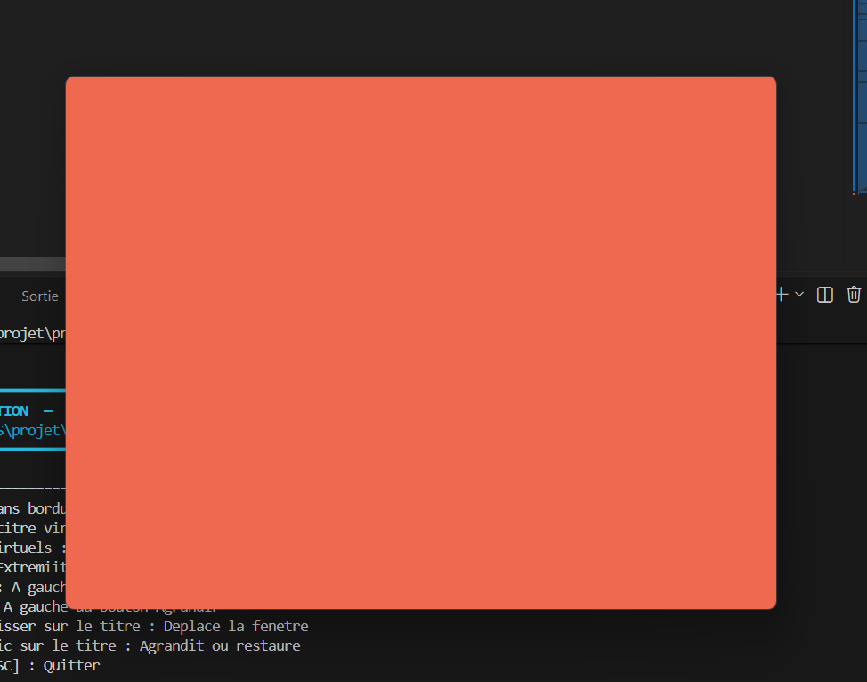

# Chapitre 03 — Exercice 10 : La fenêtre sans bordure

## 1. Code source ([`c3-exo10_main.cpp`](c3-exo10_main.cpp))

Comme une fenêtre sans bordure n'a pas de barre de titre native, cette dernière est entièrement implémentée au niveau applicatif en simulant une zone d'interaction en haut de la fenêtre.

```cpp
#include "NKWindow/NKWindow.h"
#include "NKWindow/NKMain.h"
#include "NKEvent/NkWindowEvent.h"
#include <iostream>
#include <chrono>

using namespace nkentseu;

int nkmain(const NkEntryState& state) {
    NkWindowConfig cfg;
    cfg.title      = "Exo10 - La fenetre sans bordure";
    cfg.width      = 800;
    cfg.height     = 600;
    cfg.frame = false; // Retire la barre de titre native et les bordures du systeme

    NkWindow window(cfg);
    if (!window.IsOpen()) {
        return -1;
    }

    // Dimensions de la barre de titre personnalisee
    const float titleBarHeight = 35.0f;
    const float buttonWidth    = 40.0f;

    // Etats pour le deplacement et la fenetre
    bool isDragging = false;
    math::NkVector2i dragStartMouseRel;
    math::NkVector2i dragStartWindowPos;
    bool isMaximized = false;

    // Gestion du double-clic
    auto lastClickTime = std::chrono::steady_clock::now();

    std::cout << "=================== INSTRUCTIONS ===================" << std::endl;
    std::cout << " Fenetre sans bordure creee avec succes." << std::endl;
    std::cout << " Barre de titre virtuelle : Zone superieure (Y = 0 a 35 px)" << std::endl;
    std::cout << " Boutons virtuels :" << std::endl;
    std::cout << " Fermer : Extremiite droite" << std::endl;
    std::cout << " Agrandir : A gauche du bouton Fermer" << std::endl;
    std::cout << " Reduire : A gauche du bouton Agrandir" << std::endl;
    std::cout << " Clic + Glisser sur le titre : Deplace la fenetre" << std::endl;
    std::cout << " Double-clic sur le titre : Agrandit ou restaure" << std::endl;
    std::cout << " Touche [ESC] : Quitter" << std::endl;
    std::cout << "====================================================" << std::endl;

    while (window.IsOpen()) {
        while (NkEvent* ev = NkEvents().PollEvent()) {
            if (ev->Is<NkWindowCloseEvent>()) {
                window.Close();
            }
            else if (auto* kp = ev->As<NkKeyPressEvent>()) {
                if (kp->GetKey() == NkKey::NK_ESCAPE) {
                    window.Close();
                }
            }
            // Interception des clics de la souris
            else if (auto* mp = ev->As<NkMouseButtonPressEvent>()) {
                if (mp->GetButton() == NkMouseButton::NK_MB_LEFT) {
                    float mx = static_cast<float>(mp->GetX());
                    float my = static_cast<float>(mp->GetY());
                    float winWidth = static_cast<float>(window.GetSize().x);

                    // Verification si le clic s'effectue dans la barre de titre (Y <= 35)
                    if (my <= titleBarHeight) {
                        float btnCloseStart = winWidth - buttonWidth;
                        float btnMaxStart   = winWidth - (2.0f * buttonWidth);
                        float btnMinStart   = winWidth - (3.0f * buttonWidth);

                        // 1. Bouton Fermer
                        if (mx >= btnCloseStart) {
                            std::cout << "Clic -> Fermer la fenetre" << std::endl;
                            window.Close();
                        }
                        // 2. Bouton Agrandir
                        else if (mx >= btnMaxStart) {
                            std::cout << "Clic -> Agrandir" << std::endl;
                            isMaximized = !isMaximized;
                            if (isMaximized) window.Maximize();
                            else window.Restore();
                        }
                        // 3. Bouton Reduire
                        else if (mx >= btnMinStart) {
                            std::cout << "Clic -> Reduire la fenetre" << std::endl;
                            window.Minimize();
                        }
                        // 4. Zone neutre du titre : Deplacement ou Double-Clic
                        else {
                            auto now = std::chrono::steady_clock::now();
                            auto elapsed = std::chrono::duration_cast<std::chrono::milliseconds>(now - lastClickTime).count();
                            lastClickTime = now;

                            if (elapsed < 300) { // Clics espaces de moins de 300ms
                                std::cout << "Double-clic -> Agrandir" << std::endl;
                                isMaximized = !isMaximized;
                                if (isMaximized) window.Maximize();
                                else window.Restore();
                            } else {
                                // Debut du glisser
                                isDragging = true;
                                window.CaptureMouse(true);
                                dragStartMouseRel = math::NkVector2i(mp->GetX(), mp->GetY());
                                dragStartWindowPos = window.GetPosition();
                            }
                        }
                    }
                }
            }
            // Relachement de la souris
            else if (auto* mr = ev->As<NkMouseButtonReleaseEvent>()) {
                if (mr->GetButton() == NkMouseButton::NK_MB_LEFT && isDragging) {
                    isDragging = false;
                    window.CaptureMouse(false);
                    std::cout << "Fin de deplacement" << std::endl;
                }
            }
            // Deplacement de la souris pendant le glisser
            else if (auto* mm = ev->As<NkMouseMoveEvent>()) {
                if (isDragging) {
                    math::NkVector2i currentMouseRel(mm->GetX(), mm->GetY());
                    math::NkVector2i currentWindowPos = window.GetPosition();
                    
                    // Calcul de la nouvelle position globale de la fenetre
                    math::NkVector2i newWindowPos = currentWindowPos + (currentMouseRel - dragStartMouseRel);
                    window.SetPosition(newWindowPos);
                }
            }
        }
    }

    return 0;
}
```
## 2. sortie du terminal

```powershell
 jenga run  

╔══════════════════════════════════════════════════════════════════╗
║                                                                  ║
║                ██╗███████╗███╗   ██╗ ██████╗  █████╗             ║
║                ██║██╔════╝████╗  ██║██╔════╝ ██╔══██╗            ║
║                ██║█████╗  ██╔██╗ ██║██║  ███╗███████║            ║
║           ██   ██║██╔══╝  ██║╚██╗██║██║   ██║██╔══██║            ║
║           ╚█████╔╝███████╗██║ ╚████║╚██████╔╝██║  ██║            ║
║            ╚════╝ ╚══════╝╚═╝  ╚═══╝ ╚═════╝ ╚═╝  ╚═╝            ║
║                                                                  ║
║             Multi-platform C/C++ Build System v2.8.0             ║
║                                                                  ║
╚══════════════════════════════════════════════════════════════════╝


━━━━━━━━━━━━━━━━━━━━━━━━━━━━━━━━━━━━━━━━━━━━━━━━━━━━━━━━━━━━━━━━━━━━━━━━━━━━━━━━
  ▶  EXECUTION  —  window.exe
     D:\2DS\projet\programmation_cpp\Firt_window\Firtwindow\Build\Bin\Debug-Windows\window\window.exe
━━━━━━━━━━━━━━━━━━━━━━━━━━━━━━━━━━━━━━━━━━━━━━━━━━━━━━━━━━━━━━━━━━━━━━━━━━━━━━━━

=================== INSTRUCTIONS ===================
 Fenetre sans bordure creee avec succes.
 Barre de titre virtuelle : Zone superieure (Y = 0 a 35 px)
 Boutons virtuels :
 Fermer : Extremiite droite
 Agrandir : A gauche du bouton Fermer
 Reduire : A gauche du bouton Agrandir
 Clic + Glisser sur le titre : Deplace la fenetre
 Double-clic sur le titre : Agrandit ou restaure
 Touche [ESC] : Quitter
====================================================
Fin de deplacement
Double-clic -> Agrandir
Fin de deplacement
Double-clic -> Agrandir
Clic -> Reduire la fenetre
Clic -> Agrandir
Clic -> Agrandir
Fin de deplacement
Fin de deplacement
Fin de deplacement
Clic -> Fermer la fenetre

━━━━━━━━━━━━━━━━━━━━━━━━━━━━━━━━━━━━━━━━━━━━━━━━━━━━━━━━━━━━━━━━━━━━━━━━━━━━━━━━
  ◀  FIN D'EXECUTION  —  termine normalement  (29.58s)
━━━━━━━━━━━━━━━━━━━━━━━━━━━━━━━━━━━━━━━━━━━━━━━━━━━━━━━━━━━━━━━━━━━━━━━━━━━━━━━━
```
## 3. apparence


## 4. Temps de réalisation
Temps estimé pour la conception et l'implémentation,environs 2 jour.