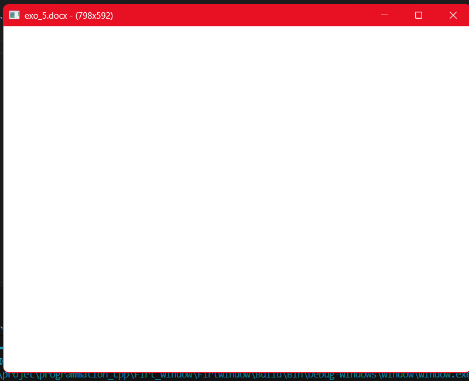
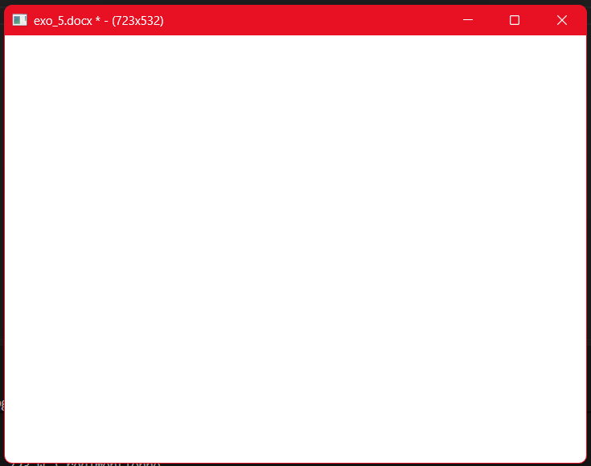

# Chapitre 03 — Exercice 5 : Le titre qui informe

## 1. Code source ([`c3-exo5_main.cpp`](c3-exo5_main.cpp))

Le programme maintient l'état d'un document (`docName`, `isModified`) et de la taille de la fenêtre. La mise à jour du titre s'effectue de manière événementielle garce à la fonction `UpdateWindowTitle`.

```cpp
#include "NKWindow/NKWindow.h"
#include "NKWindow/NKMain.h"
#include "NKEvent/NkKeyboardEvent.h"
#include "NKEvent/NkWindowEvent.h"
#include <iostream>
#include <string>

using namespace nkentseu;

// Fonction dédiée à la mise à jour du titre
void UpdateWindowTitle(NkWindow& window, const std::string& docName, bool isModified) {
    math::NkVec2u size = window.GetSize();
    
    // Construction de la chaîne : Document * (Largeur x Hauteur)
    std::string title = docName;
    if (isModified) {
        title += " *";
    }
    title += " - (" + std::to_string(size.x) + "x" + std::to_string(size.y) + ")";

    window.SetTitle(title.c_str());
}

int nkmain(const NkEntryState& state) {
    NkWindowConfig cfg;
    cfg.width  = 800;
    cfg.height = 600;

    NkWindow window(cfg);
    if (!window.IsOpen()) {
        return -1;
    }

    // État du document
    std::string docName = "exo_5.docx";
    bool isModified     = false;

    // 1. Initialisation du titre au démarrage
    UpdateWindowTitle(window, docName, isModified);

    while (window.IsOpen()) {
        while (NkEvent* ev = NkEvents().PollEvent()) {
            if (ev->Is<NkWindowCloseEvent>()) {
                window.Close();
            }
            else if (auto* kp = ev->As<NkKeyPressEvent>()) {
                if (kp->GetKey() == NkKey::NK_ESCAPE) {
                    window.Close();
                }
                // Appuyer sur 'M' simule une modification du document
                else if (kp->GetKey() == NkKey::NK_M) {
                    if (!isModified) {
                        isModified = true;
                        UpdateWindowTitle(window, docName, isModified); 
                        std::cout <<"\ndocument modifie !!";
                    }
                }
                // Appuyer sur 'S' pour enlecer l'asterix 
                else if (kp->GetKey() == NkKey::NK_S) {
                    if (isModified) {
                        isModified = false;
                        UpdateWindowTitle(window, docName, isModified);
                        std::cout <<"\ndocument sauvegarde !!";
                    }
                }
            }
            // 2. Mise à jour lors du redimensionnement de la fenêtre
            else if (ev->Is<NkWindowResizeEvent>()) {
                UpdateWindowTitle(window, docName, isModified);

                math::NkVec2u size = window.GetSize();
                std::cout << "\nla taille : ( "<< size.height<<"H , "<<size.width<<" W ) redimentionne"; 
            }
        }
    }

    return 0;
}

```

---

## 2. Déclencheurs de mise à jour

Afin d'éviter des appels coûteux de (`SetTitle`) à chaque image/frame de la boucle principale, la fonction `UpdateWindowTitle` est exécutée **uniquement** sur les événements spécifiques suivants :

1. **Initialisation :** Une fois lors du démarrage après la création de la fenêtre.
2. **Redimensionnement (`NkWindowResizeEvent`) :** Lorsque l'utilisateur modifie la taille de la fenêtre.
3. **Changement d'état du document (`NkKeyPressEvent`) :**
* **Touche `M` :** Marque le document comme modifié (ajoute l'astérisque `*`).
* **Touche `S` :** Simule la sauvegarde du document (retire l'astérisque `*`).

```powershell
jenga run  

╔══════════════════════════════════════════════════════════════════╗
║                                                                  ║
║                ██╗███████╗███╗   ██╗ ██████╗  █████╗             ║
║                ██║██╔════╝████╗  ██║██╔════╝ ██╔══██╗            ║
║                ██║█████╗  ██╔██╗ ██║██║  ███╗███████║            ║
║           ██   ██║██╔══╝  ██║╚██╗██║██║   ██║██╔══██║            ║
║           ╚█████╔╝███████╗██║ ╚████║╚██████╔╝██║  ██║            ║
║            ╚════╝ ╚══════╝╚═╝  ╚═══╝ ╚═════╝ ╚═╝  ╚═╝            ║
║                                                                  ║
║             Multi-platform C/C++ Build System v2.8.0             ║
║                                                                  ║
╚══════════════════════════════════════════════════════════════════╝


━━━━━━━━━━━━━━━━━━━━━━━━━━━━━━━━━━━━━━━━━━━━━━━━━━━━━━━━━━━━━━━━━━━━━━━━━━━━━━━━
  ▶  EXECUTION  —  window.exe
     D:\2DS\projet\programmation_cpp\Firt_window\Firtwindow\Build\Bin\Debug-Windows\window\window.exe
━━━━━━━━━━━━━━━━━━━━━━━━━━━━━━━━━━━━━━━━━━━━━━━━━━━━━━━━━━━━━━━━━━━━━━━━━━━━━━━━


la taille : ( 592H , 798 W ) redimentionne
la taille : ( 532H , 723 W ) redimentionne
la taille : ( 532H , 723 W ) redimentionne
la taille : ( 532H , 723 W ) redimentionne
la taille : ( 532H , 723 W ) redimentionne
la taille : ( 532H , 723 W ) redimentionne
document modifie !!
document sauvegarde !!
━━━━━━━━━━━━━━━━━━━━━━━━━━━━━━━━━━━━━━━━━━━━━━━━━━━━━━━━━━━━━━━━━━━━━━━━━━━━━━━━
  ◀  FIN D'EXECUTION  —  termine normalement  (97.27s)
━━━━━━━━━━━━━━━━━━━━━━━━━━━━━━━━━━━━━━━━━━━━━━━━━━━━━━━━━━━━━━━━━━━━━━━━━━━━━━━━
```

## visuels de la fenetre 
<div style="display: inline-flex; gap: 10px;">
  
  
</div>


---

## 3. Format d'affichage du titre

Le titre suit la structure demandée :

* **Non modifié :** `MonDocument.txt - (800x600)`
* **Modifié :** `MonDocument.txt * - (800x600)`
